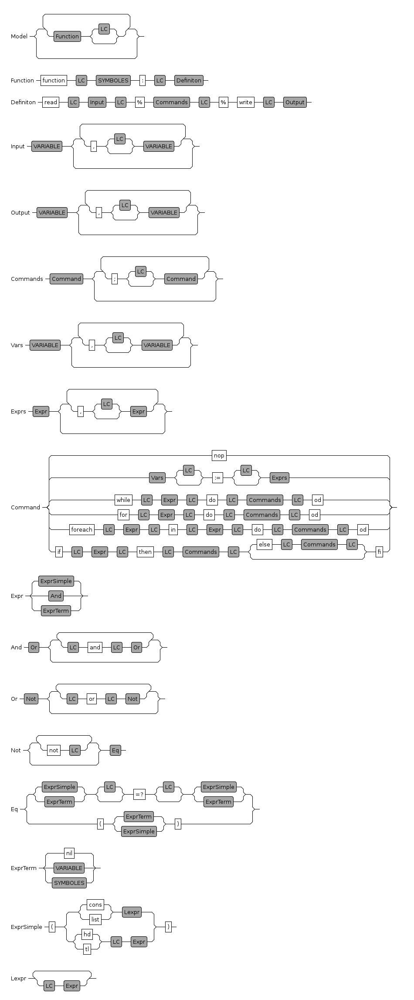

WhileToLuaTranspiler
===

WhileToLuaTranspiler is originaly a school project, hosted
[here](https://github.com/fleimme/comp).


WhileToLuaTranspiler aims to provide a working compiler from the While
language, specified for the project, to the well known Lua language.


The project is currently under a big refactoring to allow easy building
and testing and especially to get rid off all Eclipse dependencies.

While
--

Simple While program:

```
function demo:
read X
%if (X) then
  nop
else
  X := (cons nil nil)
fi
%write X
```

While grammar
---


Technical part
--

WTLT is written in Java and use [Xtext](http://www.eclipse.org/Xtext/).

### Folder structure
`org.xtext.tl.mydsl` contains the grammar part, no reason to modify this

`whc` contains the compiler, in particular the Front and Back ends.

### Build the compiler

In order to build the compiler you first need to get the While grammar library.
To do so I advise you to open `org.xtext.tl.mydsl` in Eclipse with EMF plugins.

Install the produced .jar into your local maven repository.

At this point you can remove Eclipse.

Go to `whc` and run `mvn package`, it will download all the eclipse dependancies and use the grammar to produce an executable jar under `whc/target`

You now can use the wrapper `whc/whc`

Go to whc and compile the demo file:

```
cd whc
./whc -i demo3.wh
```

For a full compiler documentation see this [readme](whc/REAMDE.md).
